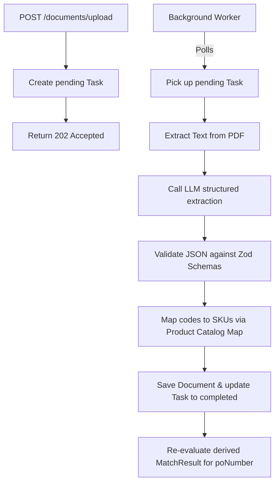

# AI-Based Three-Way Match Engine

An enterprise-ready three-way matching service designed to align Purchase Orders, Goods Received Notes (GRN), and Invoices at the line-item level. The system uses a decoupled, event-driven, state-derived architecture built with Node.js, Express, MongoDB, and Groq (LLM structured extraction).

---

## 1. Detailed Approach

The match engine is designed around five core pillars to solve the challenges of real-world document processing:

### A. Asynchronous Processing Queue
Document processing (PDF reading, page-by-page text extraction, and multiple external LLM completion calls) is computationally heavy and subject to network latency. A synchronous API request handler is highly vulnerable to Gateway Timeouts (HTTP 504) and blocks the main server thread. 
- **Solution**: The upload API adopts an asynchronous queue architecture. When a file is uploaded, the controller immediately creates a `Task` record in MongoDB with a status of `pending` and returns an HTTP `202 Accepted` response with the task context. 
- **Worker Process**: A background worker process continually queries for `pending` tasks, shifts their status to `processing`, executes the parsing pipeline, and updates the task to `completed` or `failed` upon execution.

### B. State-Derived Recalculation
Rather than tracking sequential transaction state transitions (which are fragile and easily broken by missing or out-of-order files), the match engine is **stateless** and **derived**. Each document is stored independently in MongoDB. Whenever a document is added or updated:
1. The engine queries for all documents sharing the extracted `poNumber`.
2. It aggregates all items per document type (PO, GRNs, Invoices).
3. It derives the match snapshot (`MatchResult`) from scratch based on the entire set of stored documents.
This guarantees that the match view is always correct, sequence-independent, and self-healing.

### C. Master Product Catalog Aliasing
Procurement documents use different nomenclature and identifier systems. Purchase Orders use HSN codes (e.g., `19022010`), GRNs use internal SKU numbers (e.g., `11423`), and Invoices use Vendor SKU numbers (e.g., `FG-P-F-0505`). A direct match on these values will fail.
- **Solution**: We introduce a `ProductMapping` collection in MongoDB that groups all cross-document aliases under a unique, canonical SKU. On startup, these mappings are loaded into a fast, in-memory `Map` lookup cache. The normalizer checks this cache to map identifiers to the correct SKU. If no database mapping is found, it falls back to a signature keyword-based description matcher.

### D. Resilient Provider Call Routing
LLM providers enforce strict Rate Limits (e.g., 8,000 Tokens per Minute). The extractor client is wrapped in a resilient runner that catches `HTTP 429 Rate Limit Exceeded` errors, extracts the `retry-after` header, and applies an automated pause/retry loop before continuing the extraction.

---

## 2. Comprehensive Data Model

### A. `Task` (Background Jobs)
Tracks the status of asynchronous document uploads:
- `status`: String enum (`"pending"`, `"processing"`, `"completed"`, `"failed"`)
- `documentType`: String enum (`"po"`, `"grn"`, `"invoice"`)
- `sourceFile`: Object containing:
  - `originalName`: String
  - `storagePath`: String
  - `mimeType`: String
  - `size`: Number
- `poNumber`: String (extracted once parsed)
- `documentId`: Reference to the completed `Document` record in MongoDB
- `error`: Object storing the error message, stack trace, and details if task fails

### B. `Document` (Parsed Records)
Stores the normalized structure and audit trail of each successfully processed file:
- `documentType`: String enum (`"po"`, `"grn"`, `"invoice"`)
- `poNumber`: String (normalized index)
- `documentNumber`: String (extracted PO number, GRN number, or Invoice number)
- `documentDate`: Date (ISO formatted timestamp)
- `vendorName`: String
- `items`: Array of standardized line-items:
  - `itemKey`: String (unique identifier key, e.g. `code:11423` or `desc:hot_wings`)
  - `itemCode`: String
  - `sku`: String
  - `description`: String
  - `quantity`: Number (total normalized quantity)
  - `unit`: String
- `rawExtraction`: Mixed (the exact JSON payload returned by the LLM)
- `normalizedData`: Mixed (metadata cleanup mapping)
- `sourceFile`: Object (filename and upload details)

### C. `MatchResult` (Derived Snapshots)
Cached matching state computed for a `poNumber`:
- `status`: String enum representing the match condition:
  - `matched`: All documents (PO, GRN, Invoice) exist, and every PO item is fully received and invoiced.
  - `partially_matched`: All documents exist and quantities are partially fulfilled without validation errors.
  - `mismatch`: A rule validation error has been violated.
  - `insufficient_documents`: One or more documents are missing (e.g., PO uploaded but no GRN or Invoice).
- `reasons`: Array of violated rule descriptions (reasons include: `invoice_date_after_po_date`, `grn_qty_exceeds_po_qty`, `invoice_qty_exceeds_po_qty`, `invoice_qty_exceeds_grn_qty`, `duplicate_po`, and `item_missing_in_po`).
- `linkedDocuments`: Map of linked PO, GRN, and Invoice document IDs and metadata.
- `itemResults`: Multi-dimensional item comparison grid:
  - `itemKey`: String
  - `reference`: String (display SKU or item code)
  - `description`: String
  - `poQuantity`: Number
  - `totalReceivedQuantity`: Number
  - `totalInvoicedQuantity`: Number
  - `fullyReceived`: Boolean
  - `fullyInvoiced`: Boolean

---

## 3. Parsing Flow



1. **Upload Acceptance**: Multer saves the uploaded file to disk and registers a `pending` task.
2. **Text Extraction**: The PDF document pages are processed to extract raw text strings.
3. **Structured Extraction**: The text stream is parsed by the LLM using prompt specifications guiding the model to focus on the 4-to-6 digit SKU codes.
4. **Zod Validation**: The extraction is checked against Zod schemas at runtime to verify that required fields (like `poNumber`, `items`, and quantities) are formatted correctly.
5. **Lookup & Mapping**: The items are mapped using the `ProductMapping` cache to canonical SKUs.
6. **Persistence**: The validated `Document` is written to MongoDB, and the `Task` status changes to `completed`.
7. **Match Derivation**: The match service loads all documents with the task's `poNumber` and saves the updated `MatchResult` snapshot.

---

## 4. Matching Logic

### Rules Evaluated
- **GRN quantity must not exceed PO quantity**: Rejects any case where more items are received than ordered.
- **Invoice quantity must not exceed PO quantity**: Rejects billing quantities greater than the original order.
- **Invoice quantity must not exceed total GRN quantity**: Rejects invoices billing for items that have not yet been received.
- **Invoice date must not be after PO date**: Rejects invoices dated after the PO purchase agreement.
- **Item missing in PO**: Flags any item present in the GRN or Invoice that was not ordered in the PO.
- **Duplicate PO**: Detects and flags cases where multiple distinct PO files are uploaded for the same `poNumber`.

### Status Determination Tree
1. If any PO, GRN, or Invoice is missing $\rightarrow$ `insufficient_documents`.
2. Else if any matching rule reason is violated $\rightarrow$ `mismatch`.
3. Else if all invoiced and received quantities match PO ordered quantities 1:1 $\rightarrow$ `matched`.
4. Else $\rightarrow$ `partially_matched` (e.g. quantities align but order is only partially fulfilled).

---

## 5. Out-of-Order Uploads

In real logistics, documents arrive out of sequence (e.g. the Invoice is received and billed before the goods arrive at the warehouse, or the PO is uploaded last). 
The engine supports sequence-agnostic uploads by treating documents as **independent events**. 
- Whenever a file is uploaded, the engine fetches **all** previously stored files matching the `poNumber`.
- It rebuilds the item aggregation grid from scratch.
- It upserts the `MatchResult` snapshot with the latest status.
This ensures the output is always correct, self-healing, and does not depend on a sequential state machine.

---

## 6. Assumptions

- **Single Document Files**: Each uploaded file contains exactly one PO, GRN, or Invoice.
- **Extractable PO Number**: The `poNumber` field is present and legible in the text stream of all three files.
- **Strict Date Checks**: The invoice-date check is implemented literally (invoice date <= PO date), matching the assignment rules exactly.
- **Catalog Seeding**: Mappings are populated on startup for the PO, GRN, and Invoice PDF files to align variations across different document authors.

---

## 7. Tradeoffs

- **MongoDB-Backed Queue**: We implemented a lightweight queue polling MongoDB. While a Redis-based queue (like BullMQ) is more scalable for heavy production environments, using MongoDB avoids introducing external service dependencies, making it simple to deploy locally.
- **In-Memory Catalog Cache**: Loading the mappings cache into memory at startup keeps item normalization synchronous and fast. However, in a horizontally scaled environment with multiple API container instances, we would need to integrate a PubSub event listener (e.g., Redis or MongoDB Change Streams) to synchronize cache invalidations across instances when mappings are added.
- **Local File Storage**: Uploaded files are stored on the local filesystem. In production, this would be swapped for AWS S3 or Google Cloud Storage to prevent disk space exhaustion.

---

## 8. What I Would Improve With More Time

1. **Horizontal Queue Scaling**: Swap the database worker loop for a dedicated queue broker (like **RabbitMQ** or **BullMQ**) to support multiple parallel worker containers.
2. **Dynamic Fuzzy Mapping**: Incorporate vector search or string distance algorithms (like Levenshtein distance) directly into the catalog cache to automatically link new vendor codes to SKUs without manual seed entries.
3. **Audit Trail Logging**: Create a `MatchHistory` collection to track the historical lineage of match status transitions for auditing.
4. **Human-in-the-Loop Interface**: Build a web dashboard letting users manually review, resolve, and link line items that fail validation or mapping.

---

## API Usage Examples


## Verification

Run unit and integration tests:
```bash
npm test
```
